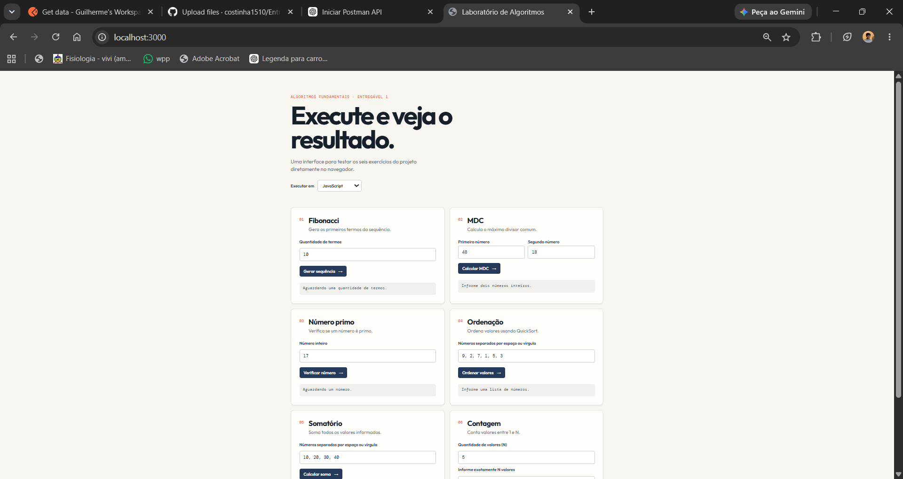

# 🧮 Frontend — Calculadora

Frontend desenvolvido para uma aplicação de calculadora, com uma interface simples e intuitiva para realizar operações matemáticas.

## 🖥️ Interface

A aplicação possui uma interface gráfica para utilização da calculadora, permitindo inserir os valores e realizar as operações disponíveis.

### 📸 Preview da aplicação



## ⚙️ Funcionalidades

O frontend permite realizar as seguintes operações:

* ➕ **Soma**
* ➖ **Subtração**
* ✖️ **Multiplicação**
* ➗ **Divisão**

## 🛠️ Tecnologias utilizadas

* **HTML5**
* **CSS3**
* **JavaScript**

## 🎨 Interface

A interface foi desenvolvida com foco em:

* Design simples e intuitivo;
* Facilidade de utilização;
* Organização dos elementos;
* Visualização clara dos resultados;
* Interação com as operações matemáticas.

## 📂 Estrutura

```text
Frontend/
│
├── index.html
├── style.css
├── script.js
└── app.png
```

## 🚀 Como executar

Para executar o frontend, basta abrir o arquivo:

```text
index.html
```

em um navegador.

Caso o frontend esteja conectado à API, o servidor da API também deve estar em execução para que as operações sejam processadas.

## 🎯 Objetivo

O objetivo do frontend é fornecer uma interface visual para a utilização da calculadora, permitindo ao usuário realizar operações matemáticas de forma simples e organizada.

## 👨‍💻 Autor

**Guilherme Costa**

Projeto acadêmico desenvolvido para fins de estudo.
